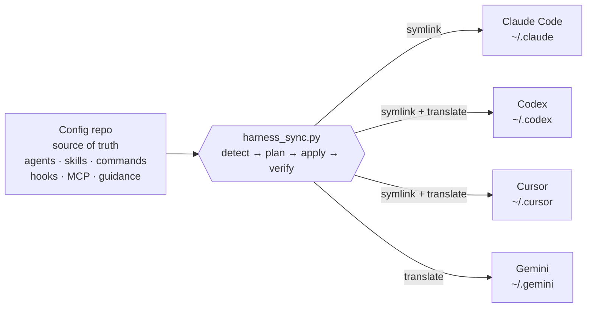
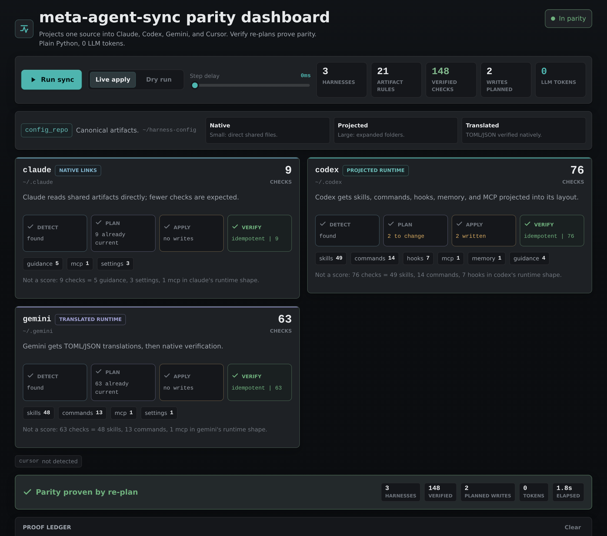

# harness-sync

**One config repo, projected into every AI coding harness on your machine.** Keep your agents, slash-commands, skills, hooks, MCP servers, and guidance files at feature parity across Claude Code, Codex, Cursor, Gemini, and whatever comes next — from a single source of truth. Deterministic, idempotent, and **zero LLM tokens** (it's plain Python).

[](LICENSE)
[](https://scorecard.dev/viewer/?uri=github.com/Dhi13man/harness-sync)


## The problem

You use more than one AI coding harness. Each keeps its config in its own place and its own format — `~/.claude`, `~/.codex/config.toml`, `~/.cursor`, `~/.gemini/settings.json`. Write a skill or a slash-command once and you're copy-pasting it four ways, and they drift the moment you touch one. Multiply by every machine you work on.

## What it does

Keep everything in **one git repo** (your source of truth). `harness-sync` detects which harnesses are installed and **projects** that repo into each one using the strategy that harness needs:

- **Symlink** where the harness reads the format natively (Claude, most of Codex/Cursor).
- **Translate** where it doesn't — e.g. commands and skills rewritten into Gemini's TOML, or Codex's `config.toml` / `hooks.json`.
- **Preserve** machine-local overlays (MCP endpoints, secrets) that shouldn't be shared.

Runs on every session start (via a hook) or on demand. The second run of an unchanged repo reports **zero changes** — idempotence is the contract, not a hope.

| Harness | Role | Detected by | Gets |
| ------- | ---- | ----------- | ---- |
| Claude Code | symlink | `~/.claude` exists | agents, commands, skills, hooks, guidance, settings |
| Codex | symlink + translate | `~/.codex/config.toml` or `AGENTS.md` | agents, skills, commands→skills, hooks→`hooks.json`, MCP→`config.toml` |
| Cursor | symlink + translate | `~/.cursor/argv.json` | skills, command wrappers, hooks, MCP→`mcp.json` |
| Gemini | translate | `~/.gemini/settings.json` | commands + skills→TOML, MCP→`settings.json` |
| _your harness_ | — | one spec dict away | see [CONTRIBUTING](CONTRIBUTING.md) |

## Install

### As a Claude Code plugin (recommended)

```bash
claude plugin install harness-sync@github.com/Dhi13man/harness-sync
# or, inside Claude Code:  /plugin install harness-sync@github.com/Dhi13man/harness-sync
```

This registers the `/meta-agent-sync` command, the `harness-sync` skill, and a SessionStart hook that keeps every harness in parity automatically. Point it at your config repo with `HARNESS_CONFIG_REPO` (default `~/harness-config`).

### Standalone (any harness, or none)

The engine is a single stdlib-only Python file — clone and run it:

```bash
git clone https://github.com/Dhi13man/harness-sync
HARNESS_CONFIG_REPO=~/harness-config \
  python3 harness-sync/skills/harness-sync/scripts/harness_sync.py --dry-run
```

Requires **Python 3.11+** (stdlib `tomllib`). No third-party dependencies.

## Your config repo

The source of truth is a git repo containing whatever you want projected. Minimum: a `CLAUDE.md` (guidance) plus `skills/` and `hooks/`. Typically also `agents/`, `commands/`, `settings.json`, and `mcp-servers.json`. A runnable example lives in [`examples/minimal-config/`](examples/minimal-config).

```text
your-config-repo/
├── CLAUDE.md            # guidance (also projected as AGENTS.md for Codex)
├── agents/              # subagent definitions
├── commands/            # slash commands
├── skills/              # skills (SKILL.md + references/ + scripts/)
├── hooks/               # hook scripts
├── settings.json        # hook wiring, permissions
└── mcp-servers.json     # MCP server manifest (secrets stay machine-local)
```

Keep it in git, sync it across machines however you like (git, Syncthing, Dropbox); `harness-sync` projects it into the harnesses on each machine.

## Usage

```bash
/meta-agent-sync              # sync every detected harness
/meta-agent-sync --dry-run    # preview changes, write nothing
/meta-agent-sync --only codex # just one harness
/meta-agent-sync --list       # what's detected on this machine
/meta-agent-sync -v           # trace every action
```

Or call the engine directly with the same flags.

## How it works



Each harness is one declarative entry in `_harness_specs()` — a detect predicate plus a list of `(source, target, strategy)` artifacts. The driver detects, applies strategies, and reports every `Change` (symlink / retarget / translate / prune / skip / error). Adding a harness is a dict entry, not a new script. Full design notes live in the [`harness-sync` skill](skills/harness-sync/SKILL.md) and its [`references/`](skills/harness-sync/references).

**Safety built in:**

- **Idempotent** — writes only when content actually changed; a clean re-run is all `skip`.
- **Never clobbers real files** — refuses to overwrite a non-symlink target; reports an `error` instead.
- **Secret-aware** — scans the merged MCP manifest for token shapes (OpenAI/Anthropic, GitHub, AWS, Slack, JWTs…) and warns before propagating; machine-local overlays are preserved, not shared.
- **`--dry-run`** everything before you trust it.

## Live demo (optional)

`harness-sync` is **CLI- and LLM-first** — the engine and the `/meta-agent-sync` command are the interface; you never need a UI to sync. For _understanding_ or _demoing_ the flow, [`demo/`](demo) is a small Flask dashboard that runs the **real** engine and streams every harness through detect → plan → apply → verify in real time (0 LLM tokens, as always). It is a visual aid, not the product.



```bash
cd demo && python3 -m pip install -r requirements.txt && ./run.sh   # → http://127.0.0.1:8765
```

Live apply vs dry run produce distinct, honest output; see [demo/README.md](demo/README.md).

## Contributing

Adding a harness, fixing a strategy, or improving detection is welcome — see [CONTRIBUTING.md](CONTRIBUTING.md). The one hard rule: **it must stay idempotent** (a second run reports zero changes).

## License

[MIT](LICENSE) © Dhiman Seal
