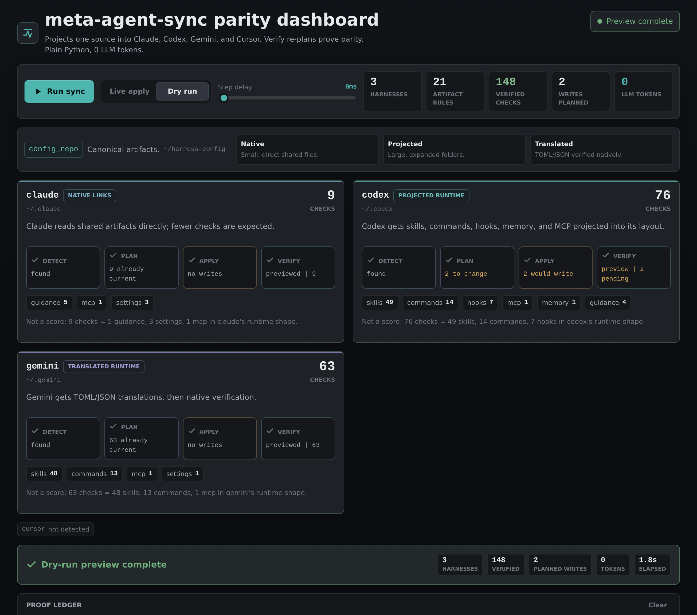

# harness-sync live demo

A browser dashboard that runs the **real** sync engine and streams every detected
harness through **detect → plan → apply → verify** in real time, with a configurable
per-step delay. The headline stays fixed at **0 LLM tokens** because the engine is
plain Python.


> **This is a visual aid, not the product.** `harness-sync` is **CLI- and
> LLM-first**: the engine (`harness_sync.py`) and the `/meta-agent-sync` command
> are how you actually use it. This dashboard exists only to *show* what the engine
> does — for understanding the flow, teaching it, or demoing it. You never need it
> to sync.

## Run it

Needs **Python 3.11+** (the engine uses stdlib `tomllib`) and **Flask** (demo-only —
the engine itself has no third-party dependencies).

```bash
python3 -m pip install -r requirements.txt   # Flask, for the demo only
./run.sh                                       # → http://127.0.0.1:8765
```

`run.sh` picks a 3.11+ interpreter itself. Point it at your config repo with
`HARNESS_CONFIG_REPO` (default `~/harness-config`); localhost-only by default.

- **Live apply** runs the real sync (the same thing the SessionStart hook does — idempotent, safe to re-run).
- **Dry run** previews without writing: apply shows *would write*, and verify stays *pending* because nothing was applied.
- **Step delay** (0–2000 ms) paces every step so the progression is easy to follow.

Rehearse offline with no server and no sync — open `static/index.html?mock=1&autorun=1`.

## Live vs dry

The two modes produce distinct, honest output. Dry run never claims parity it did not prove:

| | Live apply | Dry run |
| --- | --- | --- |
| apply | `written` | `would write` |
| verify | `idempotent` (green) | `pending` (amber) — nothing was applied |
| result | Parity proven by re-plan | Preview complete |



## How it works

```text
static/index.html   UI (EventSource) ── detect → plan → apply → verify
      │  GET /api/run (SSE)
server.py           Flask: serves the page, streams events, validates mode/delay
      │
sync_tracker.py     imports skills/harness-sync/scripts/harness_sync.py and drives it
                    one harness at a time:
                        plan   = sync(only={h}, dry_run=True)
                        apply  = sync(only={h}, dry_run=live)
                        verify = sync(only={h}, dry_run=True)
```

Every number on screen comes from a real `Report`; no sync logic is duplicated.
Idempotence is **observed**: verify re-plans and reports whether it collapsed to
skip. Per-harness counts are artifact checks in that harness's native shape, so
small native-link counts and larger projected/translated counts are both healthy.

## Make it dramatic

On an already-synced machine every step is `skip` (honest: everything in parity, 0
changes). To show a real `plan → apply → heal`, break one artifact first — e.g.
`rm ~/.codex/AGENTS.md` — then Run: plan shows `1 to change`, apply writes it, verify
goes green. Re-running afterwards is idempotent again.

## States

Empty (harnesses pending) · Running (per-cell spinner) · Ideal (green, "in parity") ·
Preview (amber, dry run) · Drift (verify did not collapse to skip) · Error (config
repo missing / stream lost).
